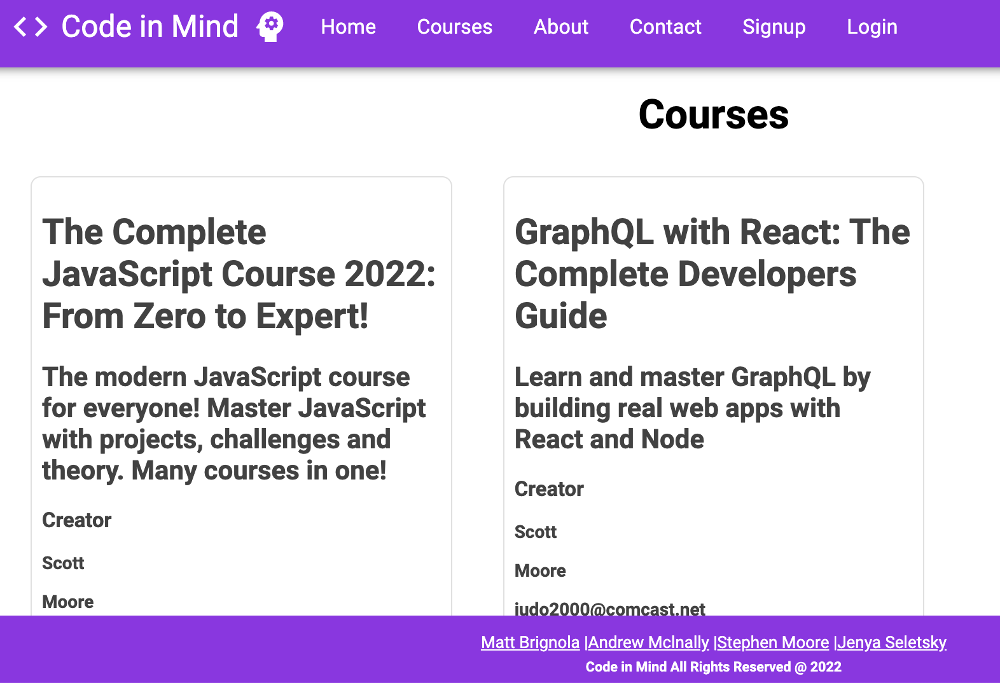

    <h3 align="center">Code In Mind</h3>

## License

## Description

This is a full stack app using the MERN stack along with Graphql. Admin users can create courses that registered users can view and click a button to enroll. User can also drop a course and admins can delete courses they create.

## Table of Contents

- [License](#license)
- [Description](#description)
- [Installation Instructions](#installation-instructions)
- [Usage](#usage)
- [Contributors](#contributors)
- [Testing](#testing)
- [Questions](#questions)

  
(<a href="#top">back to top</a>)

## Installation Instructions

  <ul>
    <li>Clone this repo by entering the folling command from the command prompt: <code>https://github.com/judo2000/crypto-cocktails.git</code></li><li>Change into the new director: <code>cd code-in-mind</code></li>
    <li>From the command prompt, enter: <code>npm i</code> to install all necessary packages</li>
    <li>To create an admin account you can do one of the following:
      <ul>
        <li>Open the server/models/User.js and change the default value for isAdmin to true</li>
        <li>Run the command <code>npm run dev</code> from the command line, to start the server</li>
        <li>Browse to localhost:3000 and click the Sign Up button and fill out the form</li>

        <li>The account created will be an admin on the site</li>
        <li>Go back to server/models/User.js and change the default value for isAdmin back to false</li>
        <li>Any subsequent accounts created will not have admin rights</li>
    </ul>

    OR

  <ul><li>The second option is toe create an account then open your database in Compass or some other program and find the record in the users tabe of the account you wish to be and admin</li><li>Double click on the value for isAdmin in that account and change it to true</li></ul></li></ul>
  
  
(<a href="#top">back to top</a>)

  
  ## Usage

A user can go to the site and click on Courses in the navbar to see which courss are available. To enroll in a course, the user must login or create an account. Once logged in the user can go back to courses and click the link to see more information then the user will see a button "Enroll in Course". If the user click this button they will be automatically enroled and redirected back to their dashboard page where all courses they are enrolled in will be displayed. On the user's dashboard there will also be a button to drop the course.

  
(<a href="#top">back to top</a>)

  
    
  ## Contributors
  Matthew Brignola, Andrew McInally, Stephen Moore, Jenya Seletsky

  
(<a href="#top">back to top</a>)

## Testing

NA

  
(<a href="#top">back to top</a>)

## Questions

<a class="hoverable" href="https://linktr.ee/matthewbrignola" target="_blank">Matt
Brignola</a> |
<a class="hoverable" href="https://linktr.ee/AndrewMcInally" target="_blank">Andrew
Mclnally</a> |
<a class="hoverable" href="https://linktr.ee/stephensmoore" target="_blank">Stephen Moore</a> |
<a class="hoverable" href="https://linktr.ee/jenya10016" target="_blank">Jenya
Seletsky</a>

  
(<a href="#top">back to top</a>)

